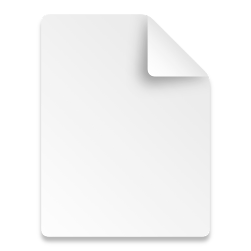

### ErgoDox EZスペック

*   Gateron Red switch
*   Blank key caps
*   With Tilt/Tent kit
*   With Wing wrist rest

### 質感、ルックス

大満足。すごいかっこいいと思ってる。

今まで使ってた [PFU Happy Hacking Keyboard Professional2 墨/無刻印](http://www.amazon.co.jp/exec/obidos/ASIN/B000F8OECM/nabetama-22/ref=nosim/) は至高だと思っていたけど、勝るとも劣らないかっこよさ。

### タイピング速度

### 導入当初

むっちゃ下がった。

特に導入初日ひどく、1/5以下だったと思う。 あまりの酷さに心が折れて、HHKBに戻して「GWに持って帰って練習します」と言って、バッグにしまった記憶がある。 その後、GWに自宅で無駄に文章やコード書いて無理矢理使い、なんとか業務に支障が無いレベルに持って行った。

### 現在

1/2くらいには盛り返してきたはず。

[CIサービスだけでErgoDoxのファームウェアをビルドして公開する](http://ymotongpoo.hatenablog.com/entry/2016/04/24/232452)を読み、

1.  keymap書く
2.  ビルド
3.  インストール

のサイクルを高速に回せるようになったというのがデカイ。やっていけそうという感覚がようやく出てきた。

### 疲労感

HHKBを使ってた時から肩こりに代表される肉体的な辛みは一切無かったので評価しづらい。

### bを右手で押してしまう問題

ErgoDox使うまで気づかなかったのだけど、bを右手で叩いてたようだ。ErgoDoxではbは左手側に存在している。 この矯正にはてこずった。というか現時点でも完璧に矯正されたわけではない。 そのため、Layer0の右手側、Nキーの横の縦長のキーをbに割り当てることでしばらく回避していた。 今も残してはいるが、ほぼ左手でタイピングするようになったのでもうぼちぼちMehにしようかと思っている。

### ErgoDox EZ使用後, 他のキーボードへの違和感がヤバイ問題

ErgoDoxを使った後、ラップトップのキーボードやHHKBを使うとtypoしまくる。 これも慣れるしかなさそう。

### ベストポジションなかなか見つからない問題

いまこれくらいのポジションなのだけど、少し右手の人差し指への負荷が高いような気がしている。

### スイッチが変わったことについての所感

いままでHHKB Professionalを使っていて、そちらは静電容量無接点方式だった。 ErgoDox EZはGateronの赤軸。静電容量無接点方式は途中まで押すとスッと入っていくような感覚があったが、 Gateron赤軸は圧力がかかりっぱなしのような気がする。 なので、もう一つ軽い白軸にしても良かったかもしれないと思った。 次に買うときは白軸でもいいかなと思う。 ていうか、東プレとか富士通がErgoDoxの静電容量無接点版を出してくれればいいのに。 そしたらすぐさま買います。

### まとめ

*   質感、ルックスには大満足
*   劇的にどこかが改善したという評価を下すことは現時点では不可
*   体がHHKBに最適化されていた