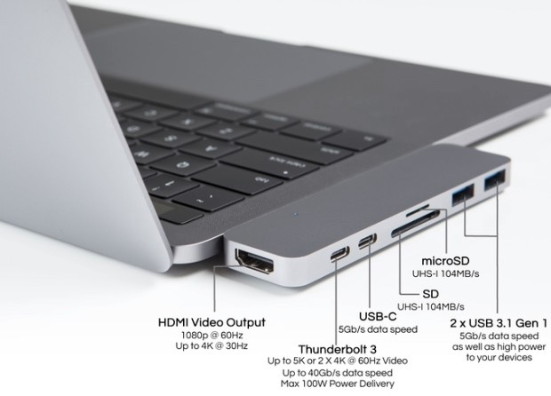
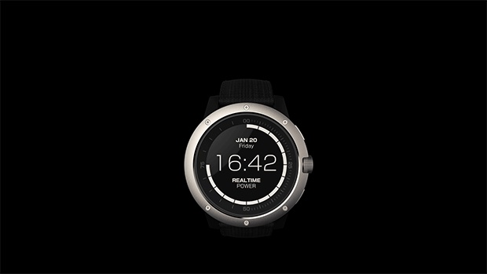

3月は転職活動を割りと頑張ってやってたり、花粉症の症状が尋常じゃなくて辛かったのできびしーと思って全然走らなかった。数回走ったが5,6kmで体きつくてやめた。

4月、思う存分に有給を消化しながら娘の幼稚園の準備を手伝ったり、ゼルダしたりしてたらあっという間に時間が経過していた。冬ランと同じ格好で走ったら暑すぎて死にそうになったので、上は長袖スパッツの上にTシャツ。下もスパッツの上にサッカーパンツというスタイルで走っている。iPhoneを持っていくことができなくなったので音楽やpodcastが聞けなくなり、iPhoneにインストールしているNike Runアプリも自宅待機してるので記録もつけられなくなった。iPod nanoを持っているんだけどいま使ってるMacBook ProはType Cしか受け付けない上に、変換アダプターやハブ等は持ってないので文鎮と化している。iPhoneのバックアップもしてない。

### 横浜マラソン応募した

42.195kmどころか20kmも走ってないけど横浜市民枠に応募した。当選したら、15000円払う上に、本気でトレーニングしないと無駄になりそうで恐ろしいので「iPhoneないからランの記録とかどうでもいいやー」みたいなの許されなさそう。落選した市民ランナーに殺されそう。なので嫁には内緒でGARMINでも買おうかと思ってる。でもそれは当選したらの話。相当倍率やばいらしいし。

### 最近のクラウドファンディング

### HyperDrive Thunderbolt 3 USB-C Hub for MacBook Pro

こんなにサポートしてくれるし、デザインも他に比べればマシだし、まさに求めていたようなハブ。こいつをindiegogoでcontributionしているんだけど！まだ！届かない！発送連絡も無い。4月中旬って言ってたのに…。

### Smartwatch Powered by You — MATRIX PowerWatch

体温と外気の温度差で金属に走る電流によって充電するスマートウォッチ。少し欲しいなと思った。GPSはついてないっぽいがおそらくは時計の振れ幅？で移動距離を測定できる。でもGPSほしいよなーやっぱり。

