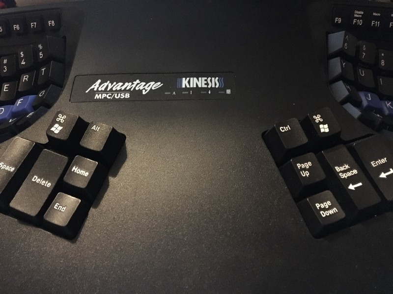
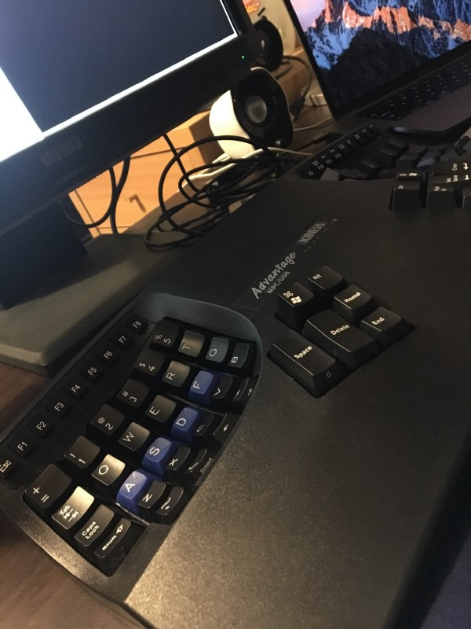

友人の家に遊びに行ったら何やら黒い塊が転がっていた。買ったはいいけど全く使ってないとのことだったので借りてきた。欲しかったら値段提示してくれれば売ってやるって言われたので1ヶ月くらい使ってみて考えようと思ってたんだけど、今日2,3時間タイピングしてたら想像以上に使いやすかったのでおそらく買う。

会社ではErgodox EZを使っている。実は、本当はKinesisが欲しかったんだけど、あまりにも高価だったためErgodox Ezを買ったというのも判断材料だった。それがふとしたタイミングで信用できる人から安価で譲り受ける事ができそうなので嬉しい。

### Ergodox EZと比べて

まだ3,4時間くらいしか触ってないけど、現時点での感想。まずは良い点。

#### keyremapが簡単

ergodoxはファームウェアの焼き直しが必要なため、ビルドしたバイナリを[teensy loader](https://www.pjrc.com/teensy/loader.html)を使って焼く必要がある。kinesisはキーボード単体でサポートしているためボタン押してポチポチするだけで終わって良い。

#### ファンクションキーがある

ErgodoxではMacのfnキーをサポートしてないため、それを実現しようとすると[Karabiner使って頑張る必要がある](https://blog.hello-world.jp.net/mac-2/4732/)（自分はめんどくさくてやってない）。kinesisだとゴムスイッチではあるが用意されているのでそれをそのまま使える。IDE使ってるとき割りと嬉しかったりすると思う。

#### Ergodoxでは届きにくかったキーが余裕で届く

ご覧の通り、くぼんでいるため全てのキーに対して手が届きやすくなっている。特に下段。またキートップを少し高めの物に変えたりするハックもできそうなので、少し遠いと思ったら変更することで変化を体感できそう。

悪い点は下記の通り

#### 少しスイッチが重い（かも）

Ergodoxはgateronの赤軸を選択して使っている。もともと使っていたHHKB Proと同じ荷重にしたんだけど、もっと軽くても良かったかなとすら思ってる（いまは慣れたが）。お借りしているKinesisのキートップを外して調べたところCherryの茶軸だった。ただタイピングしていると特に問題なさそう。まだ2,3時間しか連続で使っていないからかもしれない。  
もし今後自分が追加で購入するのであればCherry 赤軸を選んでもいいかも。

#### HやGの内側にキーが無い

Ergodoxではけっこうこれに助けられている場面が多かったんだと思った。これがキー自体のサイズも大きいので押しやすくて助かってた。

#### Ergodoxと並行して使えるかはわからない（課題）

Ergodoxとなるべく同じようなキーマップにしていきたいんだけど少し難しそう。 Ergodoxのキーと比べるとその悩みが理解頂けるのかも知れない。下段のキー数がErgodox5つに対して、Kinesisは4つなので、下段の最も内側のキーに⌘キーを当てづらいのも痛いところだ。このへんをいかにいい感じに仕上げることが出来るか。 keyremap職人の朝は早い。

[**nabetama/qmk\_firmware**  
_qmk\_firmware - keyboard controller firmware for Atmel AVR USB family_github.com](https://github.com/nabetama/qmk_firmware/blob/master/keyboard/ergodox_ez/keymaps/default/keyboard-layout-L0.png "https://github.com/nabetama/qmk_firmware/blob/master/keyboard/ergodox_ez/keymaps/default/keyboard-layout-L0.png")

### 今後

会社ではErgodox Ez, 自宅はKinesisという環境になったので上記で課題としても上げているkeymapの見直しはやっていきたい。今まで自宅で使っていたHHKB Professional 無刻印 墨は売れたら助かるのでとりあえずヤフオクにでも出してみる。箱あったかな。

<blockquote class="twitter-tweet">
これオークション出そうかな <a href="https://t.co/VzI1VGERY9">pic.twitter.com/VzI1VGERY9</a>
&mdash; nabetama (@nabetama) <a href="https://twitter.com/nabetama/status/893834864650207236?ref_src=twsrc%5Etfw">August 5, 2017</a></blockquote> 

※所要時間7秒