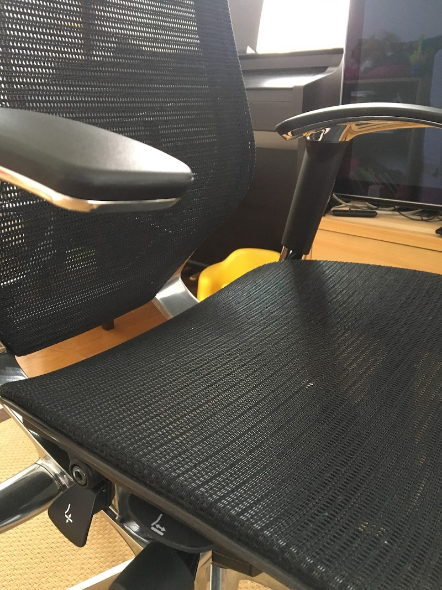
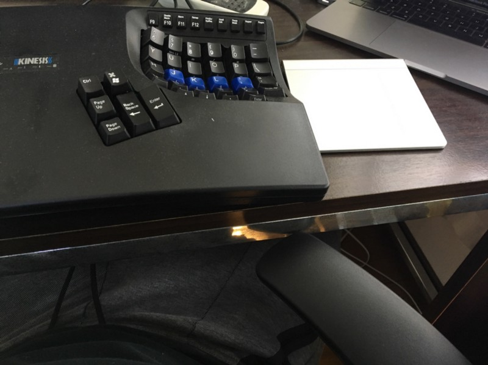

ヤマト運輸のイケメンと委託業者的なおじさん2人が2Fまで運んでくれてサイコーでした。

今まではソファやリビングテーブルなど、適当に座れる場所で作業していたのだけど、そろそろいい椅子買おうと思ってヤフオクで探して良さそうな状態のものを見つけて買った。学生の頃にどっかで買ったゴミみたいな椅子を使い続けていたので、長時間机にむかうのが苦痛だった（文字通り”苦しい痛み”を伴っていた）。これで解決したはず。

### 選択の基準

前職でアーロンチェアとバロンチェア、現職ではエルゴヒューマンと、それなりに長期間のA/Bテストを実施した結果、自分にはバロンチェアが最も合っているという定性的研究結果を得ていたので選択に迷いはなかった。といっても3種類しか試してないと言えばそれまでなんだけど、価格的にもバロンチェアは入手しやすい範囲だと思う。中古の球数が多いからなのか、「まぁこの価格で何年も使えるなら・・・！」と思える範囲にまとまっているのではないかと思ってる。

### デカくて重い

良い椅子というのは総じてデカくて重いのだが、実際にデスクの前に置いてみるとデカすぎるという感覚はなかった。ただ本当に重い(29kg)ので、一人で動かすのはやめたほうがよさそう。

### アームレストが回せるの超大事

椅子と机との距離を近づけることも出来る、腕の確度を調節しやすい等々、姿勢の自由度が高まる。もちろんアームレストの高さが調節できるのも良い、というか必須。

ぜんぜん関係ないけど上の写真で自分が履いてる[NIKEのテックフリース](https://store.nike.com/jp/ja_jp/pw/%E3%83%86%E3%83%83%E3%82%AF%E3%83%91%E3%83%83%E3%82%AF/o6k)。これも本当に最高。フリース界のイノベーションだと思っている。

### 総じて

自宅で机に向かって何かする時間が増えてきたので、このタイミングで椅子を見直したのは非常に良い選択だった。と言っても安い買い物ではないので3ヶ月くらい悩んでたが、もっと早く購入しておけば良かったとすら思う。