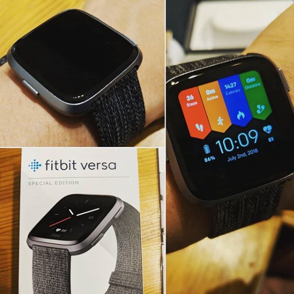
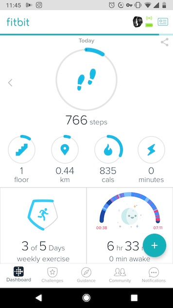

だいたい使い始めて3週間くらいの感想。ヴェルサ、ヴァーサと発音には諸説あるところだが、Youtubeで英語のレビューを聞いてみるとカタカナにすることは不可能だと思われるので気にしなくて良い。

購入したのは[スペシャルエディション](https://amzn.to/2mx1IdX)。ボディの色が気に入ったのでこれにした。スマートウォッチと呼べるものはこれが2つ目で、1つ目はKickstarterで買った[MobvoiのTicwatch S](https://www.mobvoi.com/pages/ticwatchse)だったがすでに売却済み。理由は主に以下の3つ。

1つはバンドが肌に合わなかった。これバンドが交換できないタイプで、当然わかってて使っていたんだけど、肌に合わずにかぶれたのでそこから二度とつけなくなった。

2つ目は時刻を確認するジェスチャーから時計が表示されるまでのレスポンスが悪かった。

3つ目。WearOSだけあっていろいろできるんだけど、どれもこれもやろうと思わなかった。操作してあれこれするのがめんどくさかった。

#### バンドが肌に合わない問題

大丈夫そう。いまは付属のファブリック素材のバンドにしているが連日の酷暑の中でも全くかぶれてない。もしこの先なにかあったとしても、バンドの交換が可能なのですこし安心して使える。やはり時計のバンドは交換可能でなければならない。Ionicを選ばなかったのはそこも大きい。

#### 時計としてのレスポンス

概ね問題ない。センサーが認識できずに時計が表示されないことはあるっちゃあるけど。先日、友人のApple Watchと比較してみたが、そんなに変わらないレベルにあると思った（Apple Watchのほうが精度もレスポンスも少し上だとは思うけど）。

#### 操作めんどくさい問題

圧勝。最高。アプリ入れてBluetoothと連携しておけば勝手に色々と計測してくれる。飲んだ水の量など、入力する必要がある項目もあるけど、そういった運用が必要な類は一切やらないので関係ない。なので手首につけっぱなしにして測ってくれるものだけを勝手に測って頂いている。

何も時計に触らずにランニング開始しても検知してくれるし、Fitbitアプリに表示されていることはほとんど勝手にやってくれる（気がする）。今まで気にしてなかった睡眠時間、その内訳等が勝手に記録されて「寝る前のアルコールはREM睡眠に悪い影響を与えるぞ」とか脅してくるの最高に良い🍺。

### 気に入ってるところ

#### バッテリー持ち抜群

最高ですわ。夜にお風呂に入るときだけ充電してるんだけどそれで十分。試しに3日くらい充電せずに使ってたけど60%以上残ってた。

#### 軽い

すごく軽いです。

### 良いか

良い。今まで活動量的なもの測ったことなかったのでそれが見えるようになっただけでじゅうぶん面白い。ちょっと高いけどまぁ・・・。

せっかく防水なのでプールでも使いたいんだけど、時計をつけたまま入れるプールを聞いたことないので自宅にプール作らないと厳しそう。