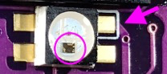

Iris Keyboardを2台作って以来、久々の電子工作。この記事はCorne cherryを使って書いています。

<blockquote class="twitter-tweet">
FとJのポッチ欲しいな <a href="https://t.co/jqOJgxMS42">pic.twitter.com/jqOJgxMS42</a>
&mdash; nabetama (@nabetama) <a href="https://twitter.com/nabetama/status/1091612654014062592?ref_src=twsrc%5Etfw">February 2, 2019</a></blockquote> 

[Iris Keyboardを2台作って](../2018-07-01)以来、久々の電子工作。この記事はCorne cherryを使って書いています。

## Corne cherryを選んだ理由

Irisをずっと使っていて、概ね満足していたんだけど

* ホームポジションを崩したくない
* LED もやってみたい
* 薄いのが良さそう
* 数字キーがないの、実際どうなんだ？

みたいな気になりが定期的に訪れてきていた。しかし、Corne cherryを知った時点ですでにBOOTHでの販売が終了していた。うまくいかないなぁと諦めていたところ、秋葉原にオープンした遊舎工房でCorne cherryを取り扱うと聞いたので実際に店舗で購入してきた。

<blockquote class="twitter-tweet">
会社の人たちと遊舎工房行ってcorner cherry買ってきました <a href="https://t.co/0kipbNhCQu">pic.twitter.com/0kipbNhCQu</a>
&mdash; nabetama (@nabetama) <a href="https://twitter.com/nabetama/status/1085538366366482432?ref_src=twsrc%5Etfw">January 16, 2019</a></blockquote> 

## おいくら？

ものを作るにはカネがかかる。今回作成にあたって購入したものを記録しておく。

* Corne cherryキット(遊舎工房 13,824円)
* [逆作用ピンセット](https://amzn.to/2I3OfrD)(Amazon 548円)
* [デジタルマルチメーター](https://amzn.to/2I2ltrx)(Amazon 2,495円)
* [フラックス](https://amzn.to/2I2mhwz)(Amazon 379円)
* [キーキャップ](https://talpkeyboard.stores.jp/items/59cce9eb428f2d1e990002ed)(TALP KEYBOARD 2,568円)
* [マグネットUSBケーブル3本セット](https://amzn.to/2HZ6Vc5)(Amazon 2,770円)

計22,584円。

    $ node
    > const sum = (...items) => {
    ... return items.reduce((sum, i) => sum + i, 0).toLocaleString();
    ... }
    undefined
    > sum(13824, 548, 2495, 379, 2568, 2770)
    '22,584'

もし初めて作るとなるとこれらに加えて
* [温度調節機能つきのはんだごて](https://amzn.to/2Iay77Y)(これ買っておけば間違いなし)
* [はんだ](https://amzn.to/2Gh3GLq)(0.8mmを使ってる)
* [工作用のマット](https://amzn.to/2SiurW4)
* Pro microモゲ対策用のエポキシ接着剤(100均でも)
* [無水エタノール](https://amzn.to/2MXMXx9)（フラックスを掃除するため。気にしない人ならなくてもよさそう）
* [精密ピンセット](https://amzn.to/2MWdxa2)
* [ニッパー](https://amzn.to/2MYnvYe)
* 精密ドライバー(100均でも)

などが必要になるためプラスで1万以上は覚悟しておいたほうがよい。道具はいいもの使ったほうが失敗リスクを減らせるのでいいもの買おう。

<blockquote class="twitter-tweet">
もげマイクロの補強だけ先にやっておく <a href="https://t.co/h3KIO85pOy">pic.twitter.com/h3KIO85pOy</a>
&mdash; nabetama (@nabetama) <a href="https://twitter.com/nabetama/status/1085904342962495488?ref_src=twsrc%5Etfw">January 17, 2019</a></blockquote> 

## ビルドログ

https://github.com/foostan/crkbd/blob/main/corne-cherry/doc/buildguide_jp.md

ビルドガイドに沿って慎重に作った。スワップ対応のため、はんだづけの箇所がIrisに比べてかなり多い。Irisは2セット買ったので、最悪失敗してもやり直しが効いたが今回はそうはいかない。
購入したものの中で重宝したのはフラックス。LEDを実装するときに最高に役に立った。ていうかフラックスなしじゃ無理。
またテスターはLEDが点灯しないときのデバッグ（物理）に重宝するのであったほうがいいと思う。
逆作用ピンセットは買わなくても良かった。通常の精密ピンセットで十分。

<blockquote class="twitter-tweet">
動作確認中<a href="https://twitter.com/hashtag/crkbd?src=hash&amp;ref_src=twsrc%5Etfw">#crkbd</a> <a href="https://t.co/szR27mvNEB">pic.twitter.com/szR27mvNEB</a>
&mdash; nabetama (@nabetama) <a href="https://twitter.com/nabetama/status/1086649027679072258?ref_src=twsrc%5Etfw">January 19, 2019</a></blockquote> 

上の写真ではPro microにMicro USBケーブルを直挿しているが、LEDを実装するときはマグネットケーブルが大変便利。LED実装して確認の際に毎度ケーブルを抜き差ししてるとそれだけで消耗する……。

## 裏面のLEDは実装難易度が高い

事前にCorne cherryのビルドガイドやビルドログを見てイメージはしていたんだけど、裏面のLED実装は難易度が本当に高かった。以下、ビルドガイドからの抜粋。

> SK6812MINIは非常に熱に弱く、簡単に壊れます。 温調機能がついたはんだごてを利用し、220℃ ~ 270℃ぐらいの温度で作業することをおすすめします。 また温度を調整しても長い時間コテをLEDに当てていると破損するので、なるべくすばやくはんだづけすることを心がけます。 LEDは４つずつはんだづけを行いますが、一度に４つ行わず、２つずつ行ってLEDの温度の上昇を防ぐと破損しづらくなるのでおすすめです。
>
> まずは取り付ける位置の確認です。
> 
> 1 ~ 6は裏面側(Undergrow)が光るようにし、7 ~ 27は表側（Backlight）が光るようにはんだづけを行います。下記がLEDを取り付ける位置です。

ここで言うところの1–6の裏面側（下図）が本当に地獄だった。

LEDを基盤に置いてはんだづけを行うが、ランドとLEDが正確にはんだづけされているかを目視で確認するのは困難を極めた。またLEDの裏側は見えないため厳しさに拍車がかかっている。

<blockquote class="twitter-tweet">
ソケット時間かかったー<a href="https://twitter.com/hashtag/crkbd?src=hash&amp;ref_src=twsrc%5Etfw">#crkbd</a> <a href="https://t.co/iMrt9O8Jd2">pic.twitter.com/iMrt9O8Jd2</a>
&mdash; nabetama (@nabetama) <a href="https://twitter.com/nabetama/status/1086670541698719744?ref_src=twsrc%5Etfw">January 19, 2019</a></blockquote> 

<blockquote class="twitter-tweet">
2個だけつけてみたLEDが原因だと思ったので剥がしたら直った。でもランドも一緒に剥がれちゃってLEDもう無理そうｗ
&mdash; nabetama (@nabetama) <a href="https://twitter.com/nabetama/status/1086689530483097600?ref_src=twsrc%5Etfw">January 19, 2019</a></blockquote> 

剥がしてしまったランドの方にLEDを少し寄せてはんだづけできそうだったので、気合ではんだづけした。なんとか致命傷にならずに済んだ。
久しぶりに深夜までデバッグ（物理）。初日は心を折られたので翌日リベンジ。

<blockquote class="twitter-tweet">
うぉぉ、1個ついた！！！
&mdash; nabetama (@nabetama) <a href="https://twitter.com/nabetama/status/1086896324119654400?ref_src=twsrc%5Etfw">January 20, 2019</a></blockquote> 

翌日、気を取り直して再度挑戦し、ようやく1つ点灯させることに成功した。点灯しているLEDの斜め左上にもLEDがはんだづけされているが、点灯していないことがわかる。
この頃、anovaでA5のももをローストビーフにしたりして正気を保ったりしていた。

<blockquote class="twitter-tweet">
A5のモモ<a href="https://twitter.com/hashtag/anova?src=hash&amp;ref_src=twsrc%5Etfw">#anova</a> <a href="https://t.co/aIwgaOEoN6">pic.twitter.com/aIwgaOEoN6</a>
&mdash; nabetama (@nabetama) <a href="https://twitter.com/nabetama/status/1086912819780452353?ref_src=twsrc%5Etfw">January 20, 2019</a></blockquote> 

翌日、2つ目を点灯させることに成功した。

<blockquote class="twitter-tweet">
2個目ついた😂😂😂 <a href="https://twitter.com/hashtag/crkbd?src=hash&amp;ref_src=twsrc%5Etfw">#crkbd</a> <a href="https://t.co/cyKGqfCgSM">pic.twitter.com/cyKGqfCgSM</a>
&mdash; nabetama (@nabetama) <a href="https://twitter.com/nabetama/status/1087336966025179136?ref_src=twsrc%5Etfw">January 21, 2019</a></blockquote> 

左右ともに裏面をすべて点灯させるまでおそらく7,8時間はかかった。いや、もっとかも。

<blockquote class="twitter-tweet">
左右ともに裏面が全て点灯した🥰<a href="https://twitter.com/hashtag/crkbd?src=hash&amp;ref_src=twsrc%5Etfw">#crkbd</a>
&mdash; nabetama (@nabetama) <a href="https://twitter.com/nabetama/status/1087356817011691522?ref_src=twsrc%5Etfw">January 21, 2019</a></blockquote> 

## 表面のLEDは難しくない

裏面に比べたら全く難しくない。LEDが不安定なので以下のような端材をキーボードの下に敷いて作業を行った。またこのあたりでマグネットUSBケーブルを導入したことで確認作業の大幅な効率化が得られた。いくらPro Microもげ対策をしているとはいえ何度も抜き差しするのは単純にめんどくさい。

<blockquote class="twitter-tweet">
右手勝った <a href="https://twitter.com/hashtag/crkbd?src=hash&amp;ref_src=twsrc%5Etfw">#crkbd</a> <a href="https://t.co/XfI3ehNryk">pic.twitter.com/XfI3ehNryk</a>
&mdash; nabetama (@nabetama) <a href="https://twitter.com/nabetama/status/1087716461630517248?ref_src=twsrc%5Etfw">January 22, 2019</a></blockquote> 

表面LEDの知見をおいておきます

- 基盤とLEDの両方にフラックス塗布
- コテ先にはんだつける
- 基盤とLEDをなぞるようにハンダ付け
- いっぺんに4箇所やらずに間をあけること
- 温度は220度

<blockquote class="twitter-tweet">
最高じゃん <a href="https://t.co/AzyokKaDNx">pic.twitter.com/AzyokKaDNx</a>
&mdash; nabetama (@nabetama) <a href="https://twitter.com/nabetama/status/1089052120202936322?ref_src=twsrc%5Etfw">January 26, 2019</a></blockquote> 

軸はKailhのSilverにした。リニアスイッチということもあって反応速度が速いらしい。キーキャップは結局黒にした。オタクっぽくって良い。

## Kailh Silver軸について

全く不満なし。Cherry Pink軸に比べてカタカタと音はするものの、特に気にならない。リニアスイッチなのでキーピッチが浅いのだけど特に実感できていない。

## キー周り
キーマップは1,2日おきに試行錯誤している。特に数字キーと記号。こればっかりはタイプしてはkeymap.cをビルドを繰り返していく他に方法がない。約2週間ほど使用してだいぶ慣れてきたがまだ模索が必要と感じる 。
これが[現時点でのキーマップ](https://github.com/nabetama/qmk_firmware/blob/master/keyboards/crkbd/keymaps/nabetama/keymap.c)。

## 良いの？

最高に良いですね。キーキャップは数日悩んでTALP KEYBOARDで黒のDSAにしてみたんだけどすごく気に入った。キーマップは慣れなので時間が解決してくれる。よく分割キーボードを使いだすきっかけとして、肩こりがあるけど、僕は肩こりとか頭痛とかがないのでよくわからない。とりあえずかっこいいと思うので使っていく。

週末に自宅に持って帰るのがめんどくさいし忘れそうなので自宅用にもう一つほしいと思ったところ、次回作（Corne chocolate？）が控えてそうな気配を感じたので、わくわくしながら待機。
