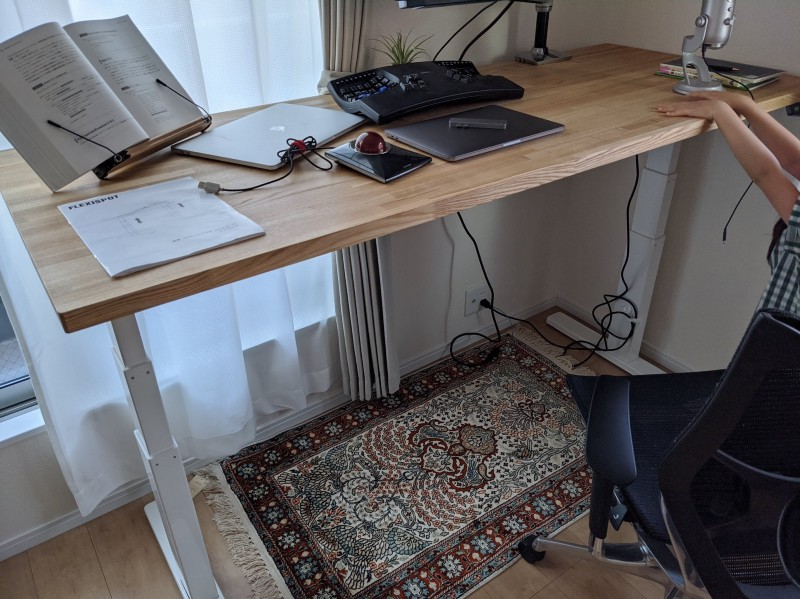
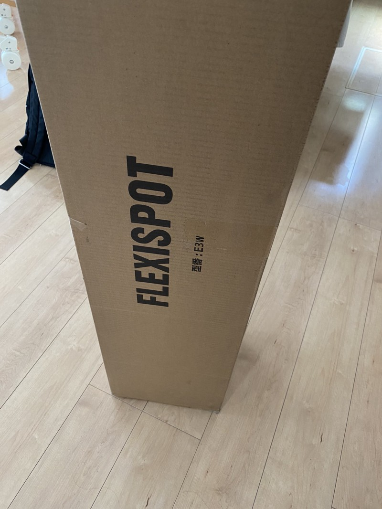
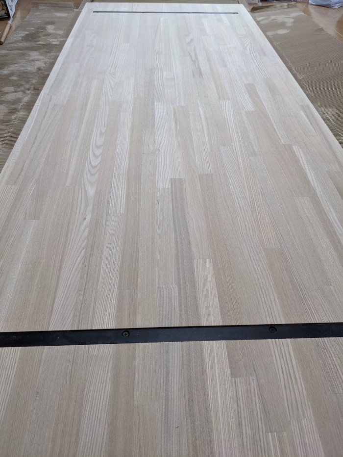
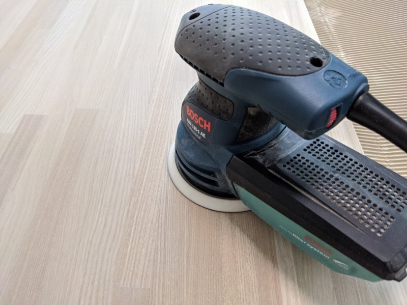
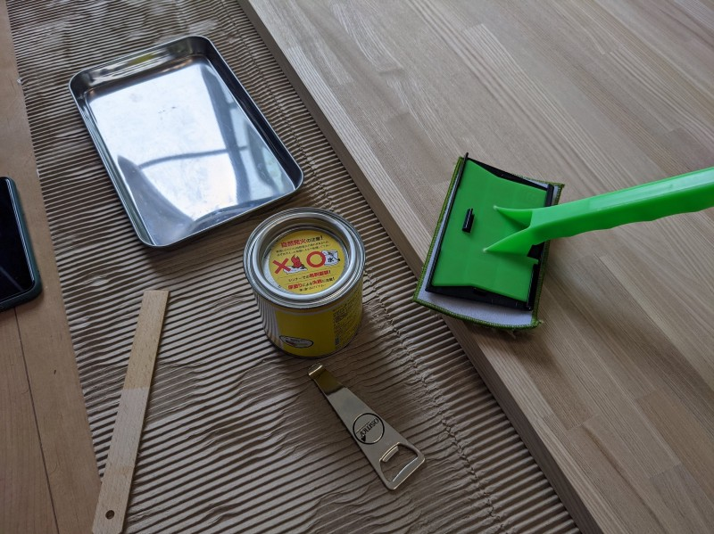
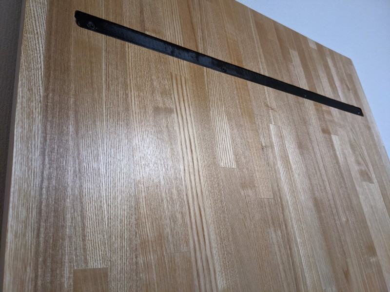
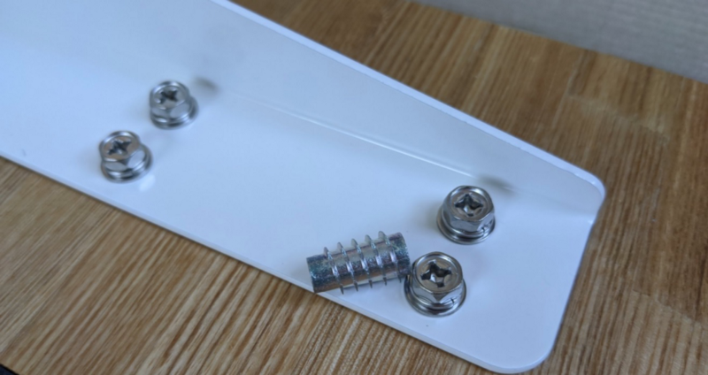
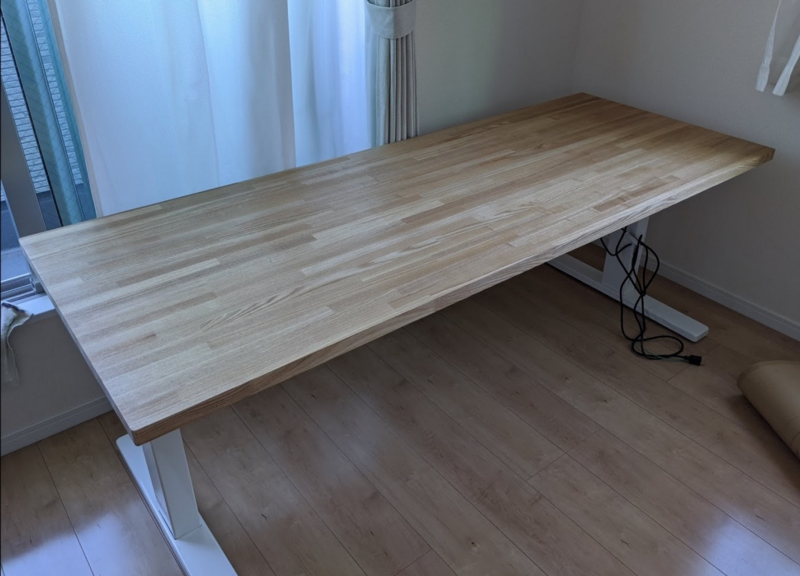

#### 材料・費用

*   FlexiSpot E3 (45,695円)
*   天板（反り止め加工, コーナーR加工, 送料込み 33,020円）
*   鬼目ナット（送料込み 2,195円）

合計で8万以上かかってしまった。すでに持っていた塗料（オスモカラー）や、これをきっかけに買い直した電動ドリルドライバーなどを考慮すると10万近くかかっているので、あと50年くらい使えるとありがたい。

『ドラえもん』という漫画の中で、主人公のび太氏が授業中に居眠りをした罰として廊下に立たされるシーンがあったと思う。いま、自分は居眠りどころか、実費で8万以上金を払ってまで立つことに執着しており、更にはそこにありがたみを感じている。全く未来というものはどうなるかわからない。

#### FlexiSpot でデスクの脚のみを購入

COVID-19 の影響を受け、3月中頃から会社が全社的にリモートワークになったこともあり、自宅環境をブラッシュアップしたい気持ちが高まっていた。

以前から安価で電動昇降デスクが作れる FlexiSpot のことは知っていたので、勢いで脚を注文してしまった。購入したのはこちらの E3 という脚(天板別売り）。

[https://flexispot.jp/height-adjustable-desks/frame-only/e3.html](https://flexispot.jp/desk/height-adjustable-desks/e3.html)

昇降範囲、高さメモリー機能の2つはどうしても譲れなかったのでこのモデル以外は選択肢がなかった（購入当時）。

#### 昇降範囲

自分の身長からすると、その他の機種の下限である 710mm は高すぎた（この時点ですでに E3 しか選択肢がない）。残念ながら身長はもう伸びないのでやむなし。

#### 高さメモリー機能

せっかく電動なのに毎回ボタン長押して拘束されたくなかった。残念ながら身長はｒｙ

上記に加え、耐荷重 100kg という点に強さを感じた。できるだけ頑丈なほうが良い。インターネットを見ていると「横揺れがすごい」と書かれていたブログがあったりしたことも少なからず影響している。

対応している天板のサイズについては「1200~2000×600~800mm」と記載されていた。自分がマルトクショップでオーダーした天板が 30 \* 700 \* 1800 (約24kg) なので、おそらく大丈夫だろう。

届いた。とにかくめちゃくちゃ重たい。梱包された状態で35kgくらいあるらしい。これを一人で玄関先まで運んだ佐川急便のお兄さんの筋力すごすぎでは…。

自分がこの鉄類を根本状態のままで2Fの自室まで運ぶのは事故のニオイがプンプンしたので 1F で開封してからパーツごとに自室に運びこんだ。

#### 天板

天板は[マルトクショップ](https://shop.woodworks-marutoku.com/)で注文した。反り止め加工については、E3 の脚で兼ねることができるんじゃないかと思ったが、本職の家具職人が作ってるデスク、テーブルを参考にしたり、YouTube でそういった方々の制作過程を見ると、反り止め加工を施工しているものがほとんどだったので、ビビって反り止め加工も注文した。この加工だけで5000円くらいするので、次に大きな天板を使う家具を作るときはトリマーを買ってもいいかなと思った。

注文したのはタモの集成材。金が無限にあれば無垢のブラックチェリーやホワイトオーク、マホガニー等にしたかったが、価格が倍以上だったのでさすがにやめた。

届いてみて封を開けたらとても綺麗だったので結果的に満足している。でも次は必ず無垢で作る。

注文したのが 4/21 。届いたのは 5/16 。途中GWが挟まったこともあって、かなり時間がかかった。マルトクショップのウェブサイトに発送までの日数が明記されているので確認しておいたほうが良い（自戒）。

#### 天板の研磨

到着した天板を触ってみたら、割とつるつるしていたのだけど、自分のようなズブの素人ではどれくらいの番手で研磨されたか全くわからないので改めて #240, #400 で磨いておいた。

#### 電動工具の価値

ちょっと脱線するが電動工具の価値について書いておく。結論から言うと電動工具には高い金を払ってでも買う価値がある。

まずは電動ドリルドライバーだ。今回の制作にあたっては FlexiSpot で購入できる天板をどうしても使いたくなかったので、天板と脚を別々に注文したり、色気を出して天板と脚を鬼目ナットで接続したりしたので電動ドリルドライバーは大変重宝した。手持ちの道具や自分の技術を鑑みるに、電動ドリルドライバーなしで組み立てるのは不可能だった。

また今回だけではなく、今後もDIY を年に数回程度やるなら必須アイテムだと思う。自分は今回の制作に合わせてマキタの [DF333DSHX](https://amzn.to/2X1Y3Xv) を購入した。それまでは RYOBI の [FDD-1000](https://amzn.to/2AxsixI) というモデル（廃版。後継で [1010](https://amzn.to/36abAAb) というモデルが出ている）をかれこれ15年くらい使っていて一切不満はなかったが、以前からコードレスのモデルが欲しかったし、燦然と輝く「Makita」ロゴがめちゃくちゃカッコいいので買った。もしコードレスのドリルドライバーを持ってないならバッテリー2個つきのものをいますぐ買うことを強く推奨する。コードレス最高。

次点で電動サンダーだ。電動ドリルドライバーについてはなんとなくめっちゃ役に立つ感が理解しやすいと思うが、電動サンダーも作業の高速化にかなり貢献してくれる。僕が使っているサンダーは [BOSCH というメーカーの吸塵タイプのやつ](https://amzn.to/2LutaWi)だ。

「え？たかだかヤスリがけ機に1万円も？」と思って延々と手動でヤスリがけしている人は今すぐ買ったほうがいい。数百円払えばレンタルしてくれるホームセンターもあるので絶対に利用したほうがいい。素人の DIY において手作業のやすりがけは地獄以外の何物でもない。やすりがけは最初から #400 などの目の細かい番手で研磨することは出来ない。板の表面状態によって, #60, #120, #240, #400 といった具合に徐々に番手を上げないといけない。つまり同じ面を幾度となく研磨する必要がある。

その苦痛以外の何物でもない単純作業を繰り返した結果、腕は死に、心は折られる。ふと顔を上げるとすでに日は沈んでいることに気づく。

「来週末、続きやろう」

そう思ったはずの作りかけの家具はもう二度と……となる前に今すぐ[電動サンダー](https://amzn.to/2ZazgDg)を買うことをおすすめする。

自分が使ってるサンダーは吸塵してくれるので木の粉が舞いにくくなっている。ただ細かな粉はどうしても出るので、いくら吸塵タイプと言えど外で使うことをおすすめする。

#### 塗装

マルトクショップでも塗装をオーダーすることもできるが、以前購入したオスモカラーが大量に余っていたので、それを使って塗装した。ちまたでよく見かけるワトコオイルやブライワックスに比べると少々高いと思うが、使用量はごく僅かで済むのでコスパはとても良いと思う。今回の板（ 30 x700 x1800） を両面塗っても大さじ3,4杯程度しか使ってなかった。ノーマルクリアーに関してはそんなに使ってないかもしれない。

研磨後によく絞ったキッチンペーパーで粉を拭き取ってからエキストラクリアーを塗った。その後、12時間以上乾燥させてからノーマルクリアーを上塗りする。塗るときはとにかく薄く伸ばすことに注意した。

#### 鬼目ナットを埋め込む

E3 購入時に付属していたネジではなく、鬼目ナットを使ってみることにした。

これがめちゃくちゃ大変だった。16箇所施工するのに2時間近くかかった。

まず9mmの下穴をあける必要があるんだけど求められる精度が鬼畜。当たり前だけど1mmくらいずれるとネジ止めは出来ない。デスク側のネジ穴をずらすことは出来ないし、6mmの穴に対して6mmのネジを使っているので遊びが一切無い。

まず脚のネジ穴に合わせて6mmの下穴を開けた。その穴を9mmに拡張するのだが、ドリルドライバーを手持ちなので全く安定しない。もう泣きたかった。

*   横着せずにドリルガイドも買えばよかったのでは？
*   デスク脚のネジ穴が6mmなら6mmの下穴で済む鬼目ナットを買えば良かったのでは？
*   そもそも取り外すことなんてないだろうし、あったとしても取り外したあとで考えても良かったのでは？

などと後悔し、涙を拭きつつではあったものの、なんとか脚と天板の接続に成功した。次に同じようなことやるときはドリルガイドを絶対に買う。今回、たまたま上手くいっただけでめちゃくちゃ後悔して終わるリスクが十分にあるので、皆さんは真似しないほうがいいです。やるなら道具を揃えてからやりましょう。

#### 完成

頑張った甲斐があった。もうずっと立って仕事します。ありがとうありがとう。

もし同じくらいのサイズで作ろうと思ったあなた。こいつは総重量が50kgくらいになっているので、無理に引き起こすと怪我します。地面から起こすときは必ず腰を落とし、下半身を使って持ち上げるように気をつけてください。

#### 使ってみて

まだ1日しか使ってないが、8時間中、6時間くらい立って仕事してみた。屈伸したり、片足立ちしてみたりと色々と試行錯誤しながらだったが、腰のだるさは無いし、仕事中に姿勢が悪くなるということもない。

着席時の高さが650mmでしっくり来たので、E3 にして正解だった。

メモリー機能は個人的には必須だ。上下動させている間、延々とボタンを押さえる作業を毎日何度も繰り返してたら発狂しそう。

タイマー機能は不要。設定した時間を経過するとアラームで教えてくれるが、ほぼ立って作業しているので設定していない。本来の用途とは少し異なるが、ポモドーロ・テクニックに使えそうなので今度試してみるつもり。

揺れは多少ある。特に横揺れが顕著。だが、昇降動作に支障のない程度にデスクを部屋のコーナーにくっつけてみるとかなり軽減された。対して前後の揺れはほとんど無い。

#### 足の裏痛み対策

素足でフローリングに立ち続けると足が痛くなるので、去年無印で購入した室内用の草履を履いたり、ヨガマットを3,4回折って下に敷いたりして負荷を和らげている。

#### TODO

*   ケーブル類を見えづらくしてスッキリさせたい
*   モニター買い換えたい