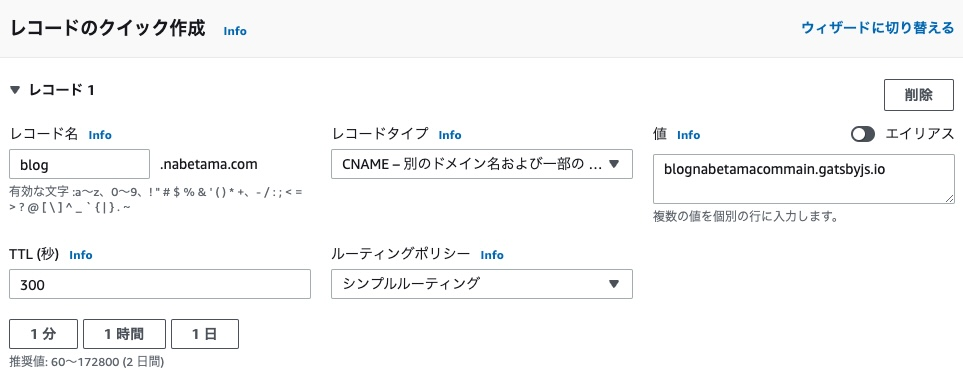

## やったこと

* [gatsby-starter-blog](https://www.gatsbyjs.com/starters/gatsbyjs/gatsby-starter-blog)を clone して編集
* githubにpush
* gatsby-cloud でホスティング
* DNS反映

gatsby-cloud でのホスティング方法は公式ドキュメントやgatsby-starter-blogのREAMDEにも書かれているのでそれに沿って進める。

## gatsby-starter-blog

* [gatsby-starter-blog](https://www.gatsbyjs.com/starters/gatsbyjs/gatsby-starter-blog)をローカルにclone
* gatsby-config.js を編集
* CSSをお気持ち程度に変更

## medium からの Export

medium の記事は幸い（？）たいした量ではなかったので、[settings](https://medium.com/me/settings)の 
「Download your information」からダウンロードした。
実行してしばらくすると「Medium download request」という件名のメールが送られてくるので、記載されたリンクから24h以内にダウンロードすれば良い。

## medium の記事を markdown に変換する

[medium-2-md](https://github.com/gautamdhameja/medium-2-md) を利用して markdown に変換した。

## Twitter のカードUI

Twitter のカードUIに対応するため、[@weknow/gatsby-remark-twitter](https://www.gatsbyjs.com/plugins/@weknow/gatsby-remark-twitter/)を入れた。
gatsby-config.js に1行追加するだけで良い。

```js
plugins: [
  {
    resolve: "gatsby-transformer-remark",
    options: {
      plugins: ["@weknow/gatsby-remark-twitter"]    // Add
    }
  }
];
```

## DNS設定

ほぼ [Adding a Custom Domain](https://support.gatsbyjs.com/hc/en-us/articles/360063469873-Adding-a-Custom-Domain)の通り。

    In the Please enter a domain field, add one of the following:
    * your apex or root domain (this is your custom domain without the www. part, e.g. mysite.com)
    * your subdomain (e.g., www.mysite.com or store.mysite.com)

と書かれている通り、apex または rootドメインであればAレコード, サブドメインであればCNAMEとして設定する。



今回はapexドメインではなくて、サブドメインなのでCNAMEレコードを設定している。

## やりたいこと

画像は別の場所にアップロードし、urlで参照するようにしたい（リポジトリにバイナリをpushしたくない）。

<iframe style="width:120px;height:240px;" marginwidth="0" marginheight="0" scrolling="no" frameborder="0" src="//rcm-fe.amazon-adsystem.com/e/cm?lt1=_blank&bc1=000000&IS2=1&bg1=FFFFFF&fc1=000000&lc1=0000FF&t=nabetama-22&language=ja_JP&o=9&p=8&l=as4&m=amazon&f=ifr&ref=as_ss_li_til&asins=4839973008&linkId=d1bac03a33b2156f0f494177ea92fcfc"></iframe>
